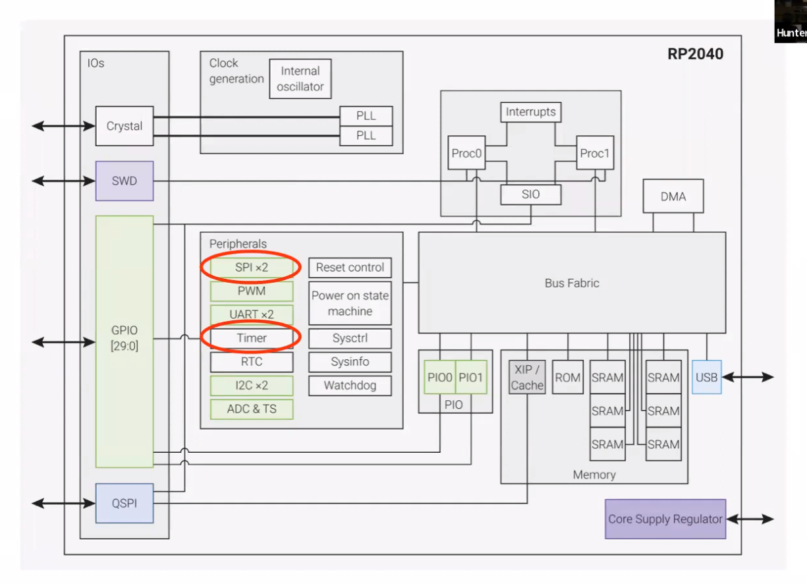

# Digital Systems Design Using Microcontrollers - Cornell

## Table of contents

- [Session 1 - course introduction](#week1)
    - [RP2040 specs](#rp2040-specs)
- [Session 2 - Hardware/Software Overview](#week2)
    - [Levels of abstraction of between hardware and software](#levels-abs)
    - [RP2040 Hardware](#rp2040-hw)
    - [GPIO ports](#gpio-ports)
    - [C SDK levels of abstraction](#c-sdk-abs)
- [Session 3 - Timers, timer interrupts, SPI](#week3)
    - [Code run-through](#code-runthrough)
    - [Notes on the timer peripheral & SDK](#timer-peripheral-notes)
- [Session 4 - Direct Digital Synthesis](#week4)
    - [Central abstraction](#central-abstraction)
    - [The DDS Algorithm](#dds-algo)
    - [How big does the sine table need to be?](#how-big-sine-table)
    - [How to index into the sine table?](#how-index-sine)
    - [Common questions](#common-qs)
    

<a id="week1"></a>

## Session 1 - course introduction

<a id="rp2040-specs"></a>

### RP2040 specs:
__dual ARM Cortex-M0+ cores__

__12 DMA channels (Direct Memory Access)__
- simple co-processors that you can use to move data from one place in memory to another place in memory with no CPU interaction

__2 UARTs__

__2 SPI channels__

__2 I2C channels__

__16 PWM channels__

__USB 1.1 controller__

__30 GPIO pins__

__12-bit ADC with 5-input MUX__

__8 PIO state machines__
- Programmable Input Output state machines
- co-processors that live inside the RP2040 that you can write programs for
- written in custom assembly language called PIO assembly (9 instructions)
- powerful for building custom high-speed comms interfaces from RP2040 to some other device

__8-cycle integer divider__
- hardware in the RP2040 that's been designed to speed up divide operations

__Interpolator__

__264kB on chip SRAM__

__QSPI interface to external flash__

<a id="week2"></a>

## Session 2 - Hardware/Software Overview

<a id="levels-abs"></a>

### Levels of abstraction of between hardware and software


- all things in white box are controlled by manipulating the registers (place in memory)
- there are 1000s of registers, some coupled with others
- you can directly manipulate these registers but it's cumbersome
- the RP2040 C SDK abstracts these register manipulations into an API to make it more manageable
- this course will be working mainly at the SDK level
- protothreads is a lightweight threading library for the RP2040 (not developed by raspberry pi though), that allows you to set up RP2040 programs as concurrent threaded programs

<a id="rp2040-hw"></a>

### RP2040 Hardware


- two processors that share 26 interrupts
- both connected to SIO (single-cycle IO)
    - all the 'stuff' in the SIO, the CPUs can 'talk to' in 1 cycle (much faster than through the BUS). Includes but not limited to:
    - CPUID to keep track of what core
    - FIFO each way (32 bit wide 8 sample deep) used to push and pop data from one core to the other (good way to sync the cores incidentally)
    - 32 hardware spinlocks
        - provides a mechanism for one core to lock out the other core from a shared resource (global variable etc.)
        - spinlocks 0-25 already used (read datasheets)
- 12 DMA channels, each capable of 32 bit transaction per CPU cycle
- USB connection
- SRAM organised in 6 blocks
- on-chip ROM (containing bootloader etc. Won't be used on this course)
- on-board cache that communicates out through the QSPI interface to external flash memory holding our program code
- PIO ports
    - assembly ode can be written to directly manipulate GPIOs
- peripherals:
    - if green, can form a connection from these to the GPIO ports
    - ADC clock runs at 48MHz, a single sample always takes 96 of those, meaning 2 microseconds/sample ADC

<a id="gpio-ports"></a>

### GPIO Ports


- above shows which internal hardware peripherals can be mapped to which GPIO ports
- another pico can be used to debug the pico itself, using ports shown at bottom of image

<a id="c-sdk-abs"></a>

### C SDK levels of abstraction

The C SDK abstracts register manipulations to function calls


- arranged hierarchically
- hardware_regs: 
    - hardware_regs folder in library, has a #define that gives a name for every register
    - associates memory locations to something readable
- hardware_structs:
    - organises all the registers into C structs in such a way as to represent the memory-mapped layout of the RP2040
- hardware support libraries (most of the courses work will be done at this level):
    - provides an API for interacting with each piece of physical hardware
- higher-level libraries:
    - higher level abstractions for combining multiple hardware support library functions in one

<a id="week3"></a>

## Session 3 - Timers, timer interrupts, SPI

This session will talk about the timer peripheral, how to set up timer interrupts, ISRs (Interrupt Service Routines) and the SPI peripheral. Below is the main code for this session with some comments attached from the lecture. In short, the code sets up an SPI channel with an external DAC (Digital to Analogue Converter, a device that you send digital information, and it the converts that to an analogue voltage for communication to something like a speaker for instance). It then sets up a timer interrupt that interrupts at precisely 40KHz (40,000/s), that when the ISR is entered, a new SPI transaction is sent to the DAC. The consequence should be a pure tone coming from the speaker.

The algorithm used to synthesise the audio of a desired frequency is called Direct Digital Synthesis (DDS). More on this in a later session.

<a id="code-runthrough"></a>

### Code run-through:

```c
/**
 * V. Hunter Adams
 * DDS of sine wave on MCP4822 DAC w/ ISR
 * 
 * Modified example code from Raspberry Pi
 * Copyright (c) 2020 Raspberry Pi (Trading) Ltd.
 *
 * SPDX-License-Identifier: BSD-3-Clause
 *
   GPIO 5 (pin 7) Chip select
   GPIO 6 (pin 9) SCK/spi0_sclk
   GPIO 7 (pin 10) MOSI/spi0_tx
   3.3v (pin 36) -> VCC on DAC 
   GND (pin 3)  -> GND on DAC 
 */

// standard C libraries
#include <stdio.h>
#include <math.h>
// pico C SDK libraries
#include "pico/stdlib.h"
#include "hardware/spi.h" // pico hardware interface library. needs to be linked in CMakeLists.txt

//DDS parameters
#define two32 4294967296.0 // 2^32 
#define Fs 40000
// the DDS units:
// volatile keyword tells the system that it should retrieve the most updated value for that variable from memory every time it's used. So anything updated asynchronously should have the keyword volatile added
volatile unsigned int phase_accum_main;
volatile unsigned int phase_incr_main = (800.0*two32)/Fs ;//

// SPI data
// uint16 is a short, the DAC expects 16 bit transactions
uint16_t DAC_data ; // output value

//DAC parameters
// contains all the data the we'll send the DAC. 
// It's a 12 bit DAC, so we'll mask in the bottom 12 bits (the value we want to convert to an analogue voltage)
// all 0s will be 0.0V, 2^12 will be 3.3V
// The top 4 bits are config bits for the DAC i.e. which channel, voltage range, reset bit etc.
// A-channel, 1x, active
#define DAC_config_chan_A 0b0011000000000000
// B-channel, 1x, active
#define DAC_config_chan_B 0b1011000000000000

//SPI configurations
// here we're associating names with GPIO ports
#define PIN_MISO 4
#define PIN_CS   5
#define PIN_SCK  6
#define PIN_MOSI 7
#define SPI_PORT spi0

// DDS sine table
// this is to store the amplitudes of one period of a sine wave in an array (for DDS)
#define sine_table_size 256
volatile int sin_table[sine_table_size] ;

// Timer ISR
bool repeating_timer_callback(struct repeating_timer *t) {
	// DDS phase and sine table lookup
	phase_accum_main += phase_incr_main  ;
    DAC_data = (DAC_config_chan_A | ((sin_table[phase_accum_main>>24] + 2048) & 0xffff))  ;

    spi_write16_blocking(SPI_PORT, &DAC_data, 1) ;

    return true;
}

int main() {
    // Initialize stdio
    // sets up default UART port on GPIO 0 & 1
    stdio_init_all();
    printf("Hello, DAC!\n");

    // Initialize SPI channel (channel, baud rate set to 20MHz)
    // baud rate is how many bits/s is sent over the channel
    // baud rate comes from the data sheet of the device you're trying to communicate with
    spi_init(SPI_PORT, 20000000) ;
    // Format (channel, data bits per transfer, polarity, phase, order)
    // this configures the channel
    // data bits per transfer comes from the data sheet of the device you're trying to communicate with
    // for more info on polarity, phase and order, see the course website for supplementary notes on SPI comms

    spi_set_format(SPI_PORT, 16, 0, 0, 0);

    // Map SPI signals to GPIO ports
    gpio_set_function(PIN_MISO, GPIO_FUNC_SPI);
    gpio_set_function(PIN_SCK, GPIO_FUNC_SPI);
    gpio_set_function(PIN_MOSI, GPIO_FUNC_SPI);
    gpio_set_function(PIN_CS, GPIO_FUNC_SPI) ;

    // === build the sine lookup table =======
   	// scaled to produce values between 0 and 4096
    int ii;
    for (ii = 0; ii < sine_table_size; ii++){
         sin_table[ii] = (int)(2047*sin((float)ii*6.283/(float)sine_table_size));
    }

    // Create a repeating timer that calls repeating_timer_callback.
    // If the delay is > 0 then this is the delay between the previous callback ending and the next starting.
    // If the delay is negative (see below) then the next call to the callback will be exactly x us after the
    // start of the call to the last callback
    struct repeating_timer timer;

    // Negative delay so means we will call repeating_timer_callback, and call it again
    // 25us (40kHz) later regardless of how long the callback took to execute
    add_repeating_timer_us(-25, repeating_timer_callback, NULL, &timer);
    while(1){
    }
    return 0;
}
```

For clarity, this shows what peripherals have been touched upon in this session:



It's common when learning a new micro controller to initially get an LED to blink, and then as a next project get a timer interrupt working.

<a id="timer-peripheral-notes"></a>

### Notes on the timer peripheral & SDK

- at the lowest level, there's a piece of hardware inside the RP2040 that ticks at 1/us
- There's a 64-bit timer inside the RP2040 (two 32-bit registers, most significant 32 bits in one register, least significant bits on other register)
- once per us, every us, the value incr. by 1
- therefore overflows once every approx. 500,000 years
- bottom 32-bits overflow every approx. 72 mins so if you're trying to set up an interrupt event longer than 72 mins then use another peripheral (real-time clock)
- associated with the time peripheral, are 4 32-bit alarm registers (alarm 0, 1, 2, & 3)
- if you write a value to any of those registers, and associate an interrupt with them, then once the bottom 32-bits of the timer peripheral matches the alarm register the interrupt will be called
- the C SDK abstracts this capability into the hardware library for the timer so you don't have to manipulate the registers yourself (this is the lowest level abstraction beside writing to registers yourself)
- You could write logic into the interrupt to repeatedly call the timer at a specified delay
- Raspberry PI company understood this would be a commonly done thing and so incl. that in the SDK at a higher level of abstraction in the pico_time high level library (repeating_timer function)

<a id="week4"></a>

## Session 4 - Direct Digital Synthesis

<a id="central-abstraction"></a>

### Central abstraction

DDS allows you to synthesise a sine waveform of a desired frequency within fractions of fractions of Hz with minimal memory & computation

- The sine wave is the projection of a rotating phaser onto the imaginary axis
- overflowing a variable is isomorphic to one rotation of a phaser
- we can represent the angle of a phaser with a 32-bit number we'll call the accumulator
- As a consequence, incrementing the accumulator is interpreted as rotating the phaser


<a id="dds-algo"></a>

### The DDS Algorithm

V. Hunter Adams' website has an in-depth page for the DDS algorithm and how it pertains to the project. For a full treatment [see here](https://vanhunteradams.com/DDS/DDS.html)

- audio synthesis requires precise timing. Samples will be sent to the DAC at a fixed rate, $F_s (Hz)$
- a timer interrupt will be used to achieve that timing
- incrementing the accumulator is interpreted as a rotation of the phaser. The faster you increment, the higher the sine wave frequency
- in order to produce a sine wave of a desired frequency:
    1. enter the repeating timer callback function
    2. increment the accumulator
    3. lookup the amplitude of the sine wave at that phaser angle
    4. send the amplitude to the DAC
    5. leave the repeating timer callback function
    6. $\frac 1 F_s$ seconds later, re-enter and go back to (1)
- in step 2, the _more_ the accumulator is incremented, the faster the phaser is rotating, and the higher frequency the output sine wave. How do we know how much to increment in order to achieve a desired output frequency?

taken from the DDS page: 

$N$ = increment amount = $\frac {F_{out}} {F_s} \times 2^{32}$

<a id="how-big-sine-table"></a>

### How big does the sine table need to be?

paraphrased from the web page:

> If you use an int for your accumulator, then the accumulator variable can, in principle, assume  $2^{32}$ different states. However, you do not need a sine lookup table that is $2^{32}$ elements long. You can get away with significantly less entries than that. How many is enough?
> 
> The less entries that you have in your sine table, the more harmonic distortion you will hear in your generated tones. This is due to the fact that the DAC acts like a zeroth-order hold. If you send it a value, it retains that value until you send it a new one. So, smooth sine waves become the jagged approximations to sine waves shown below. The more entries in your sine table, the better this approximation.
> 
> A way of thinking about this is that we have a square-wave carrier wave being modulated by a sine wave. 
> 
> Note that the fundamental frequency (the frequency of interests) remains fixed at fft index 1, which corresponds to a frequency of 1 cycle. The first error harmonic is approximately at the number of entries in the table (i.e. the sample frequency) minus 1. So, as you increase the number of entries in the table, the first error harmonic moves away from the fundamental. As you increase the entries in your table, the first error harmonic also decreases in amplitude relative to the fundamental (attenuates).

<a id="how-index-sine"></a>

### How to index into the sine table?

- use the most significant 8 bits of your accumulator to index into the sine table

<a id="common-qs"></a>

### Common questions

> Question: If we are only using 8 bits to index into a sine table, why does our accumulator need to be more than 8 bits?
> 
> Answer: By having an integrator that is greater than 8 bits, you are able to step by a fractional index through your sine table. This means that, depending on the frequency you're synthesizing, you may send the same entry of the sine table to the DAC a few samples in a row. That's ok! Or, if you're synthesizing a higher frequency, you may skip entries in your sine table. That's ok too, as long as you skip the correct entries. The DDS algorithm makes certain that you do.

> Question: How else could I improve my output waveform (i.e. decrease the amplitude of the error harmonics) without sampling faster, and without adding more entries to a lookup table?
> 
> Answer: You could add an analog low-pass filter to the DAC output! If you set the cutoff frequency so that it will pass signals as high as you're trying to synthesize and attenuates all higher frequencies, then you get a significant reduction in error harmonics for free. Use hardware when you can!


## Week 6 - 